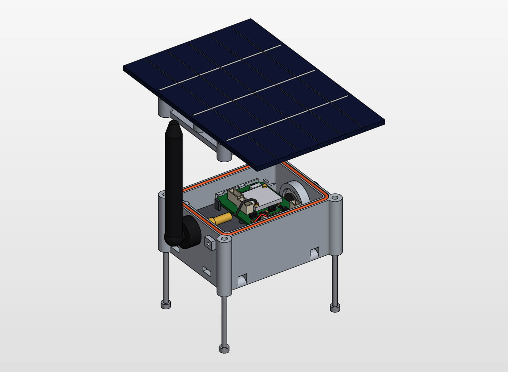
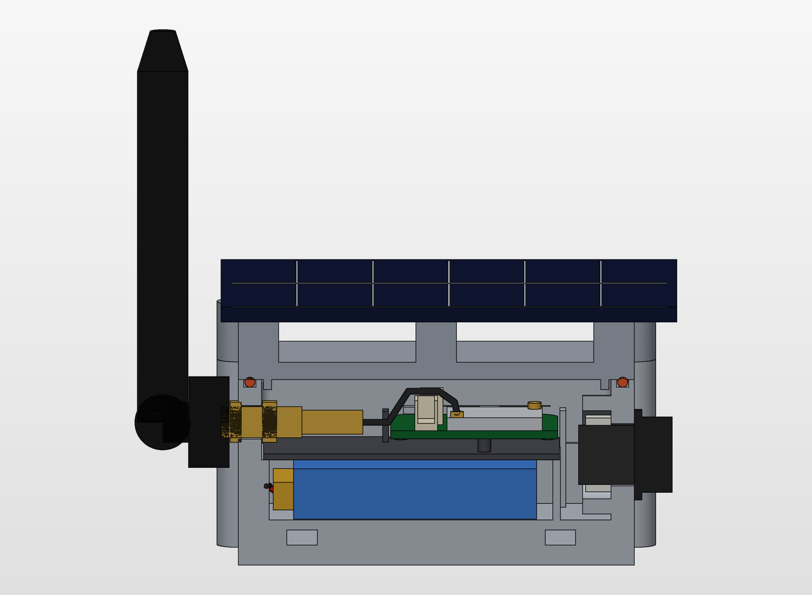
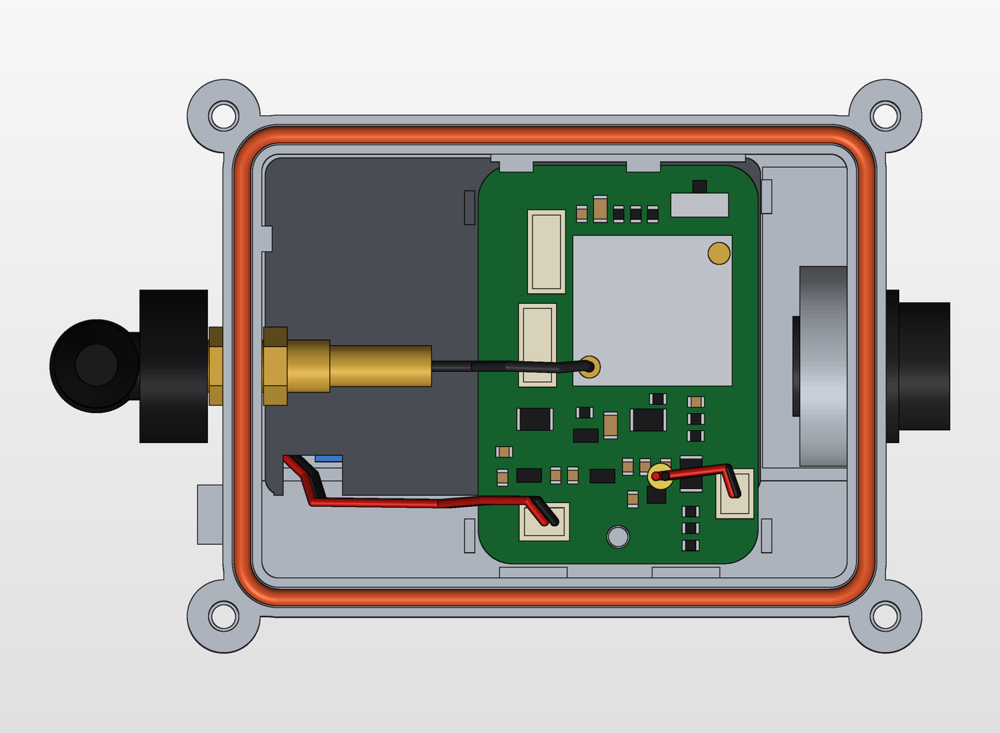
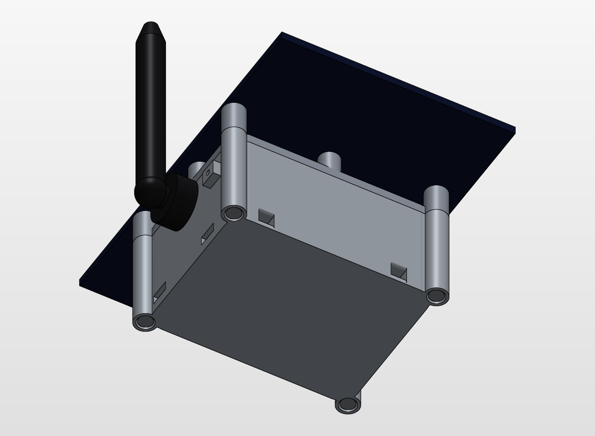

## What is this thing?

This is a box for SolarMeshtasticNodeMini

## Material

For best UV and water protection I recommend a bright Nylon print.

Example material for JLC3DP:  3301PA Nylon  with SLS.

You *must* prevent the case from warming up! 

Stay within usual LiPo temperature corridor which is between 0-45°C.

## Components to buy

- 4x M3x40 A4 from below, captive in a 2.8 mm neck, into 4 heat set inserts, hole 4.0 x 7 mm
- 1x M2.5x6 for the PCB
- 2 mm silicone O-ring cord, approx. 260 mm
- SMA bulkhead to U.FL, nose up to 20 mm, cable at least 90 mm
- M12 ePTFE vent plug, potting compound for the solar cable, MS polymer for the panel
 
### License

CERN Open Hardware Licence Version 2 - Strongly Reciprocal
