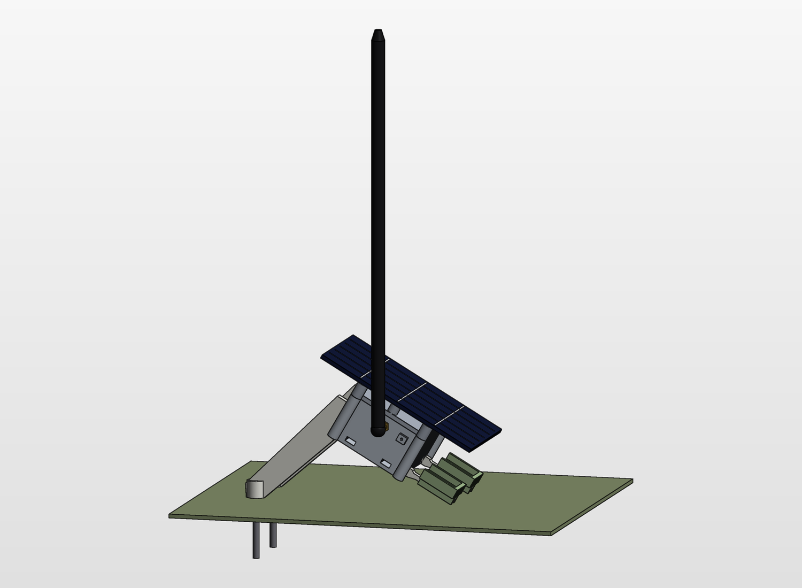
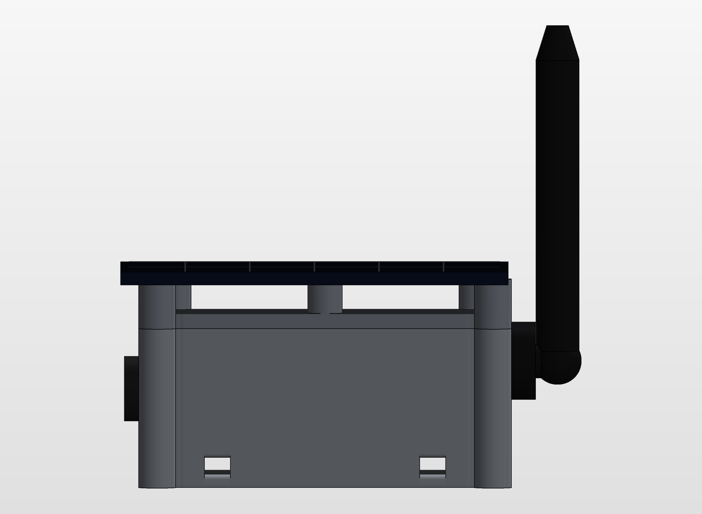
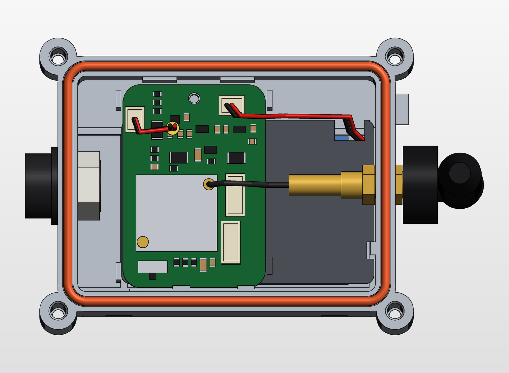
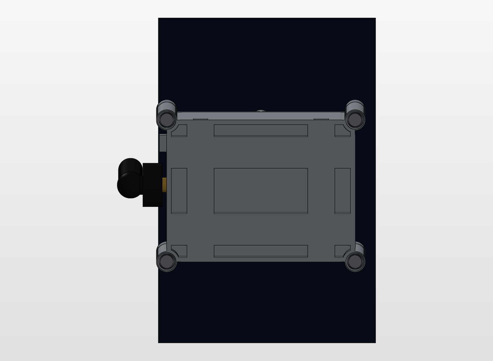

## Purpose

This box holds the SolarMeshtasticNodeMini node.

## Dimensions

The body is 78.2 x 59.2 x 40.5 mm, and the screw columns bring the footprint to 86.6 x 67.6 mm.

The solar panel and its spacers add 11 mm.

The inner cavity is 69 x 50 x 28 mm, and the vent chamber occupies x 59 to 69.

## Components to buy

- LiPo 103450 with a JST-PH lead, or LiPo 852040 with the adapter tray
- SMA bulkhead to U.FL, nose up to 20 mm, cable at least 90 mm
- ePTFE vent plug, thread 12 mm diameter and 10 mm long, head up to 20 mm, with its plastic nut
- Solar panel up to 135 x 90 mm, glued to the spacers with MS polymer
- 2 mm silicone O-ring cord, about 260 mm
- 4 M3x40 A4 screws, fitted from below, captive in a 2.7 mm neck, into 4 heat set inserts with a
  4.0 mm bore, 7 mm deep
- 1 M2.5x6 screw for the PCB, with a 2.1 mm pilot
- Cable ties 5 x 1.5 mm, or cord up to 3 mm, for the lashing tunnels

## Wind

The tipping speed comes from `tools/stability.py`. The stone sits in the ballast trays.

| setup | tips at | for reference |
|---|---|---|
| bare | 12.1 m/s | 44 km/h |
| 1 kg of stone in the trays | 14.5 m/s | 52 km/h |
| 2 kg of stone in the trays | 16.4 m/s | 59 km/h |

## Checks

The tools in `tools/` prove the numbers in this file. They need FreeCAD 1.0 with gmsh and ccx, and
every one of them writes a `.json` report beside itself.

| tool | what it proves |
|---|---|
| `design_rules.py` | the wall thickness, the holes, the gaps, the shell count, the build volume, and the collisions |
| `tolerance_mc.py` | every fit that has to go together, by Monte Carlo |
| `montage_simulation.py` | every step of the build order, over the full insertion travel |
| `clearance_probe.py` | the free radius around every fastener and nut |
| `stability.py` | the tipping speed, the hold-down force and the ballast mass |
| `thermal_lumped.py` | the internal temperature in the sun |
| `integrity_check.py` | the committed STEP files against a fresh run of the macro |

Run each one from `tools/`, as its docstring says.

## License

CERN Open Hardware Licence Version 2 - Strongly Reciprocal
